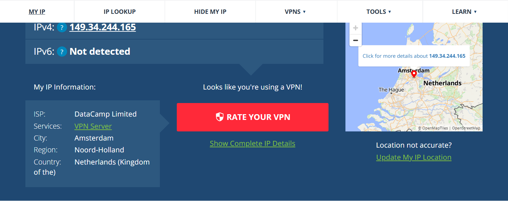

# 🌐 VPN Usage Report 

## 🛠 VPN Used
- ProtonVPN (Free Version)

## 🔄 IP Before and After

| Status         | IP Address      | Location       |
|----------------|------------------|----------------|
| Before VPN     | 49.42.186.241    | Bhubaneshwar, Odisha, India |
| After VPN      | 149.34.244.165   | Amsterdam, Noord-Holland, Netherlands |

### Detailed IP Info:

**Before VPN:**
- ISP: Reliance Jio Infocomm Limited
- City: Bhubaneshwar
- Region: Odisha
- Country: India

**After VPN:**
- ISP: DataCamp Limited
- Services: VPN Server
- City: Amsterdam
- Region: Noord-Holland
- Country: Netherlands (Kingdom of the)

## 🌐 Sites Visited
- https://www.google.com
- https://whatismyipaddress.com

## 🖼 Screenshot
📷 `vpn-connected.png` – 

## ✅ Observations
- IP address and location changed successfully
- VPN connection encrypted traffic
- Websites loaded slightly slower but worked correctly

## 🔐 VPN Benefits
- Masks real IP address
- Protects online privacy and data
- Safe browsing on public Wi-Fi

## ⚠️ VPN Limitations
- Slightly slower internet speed
- Free version has limited server choices
- Doesn’t block malware or phishing

